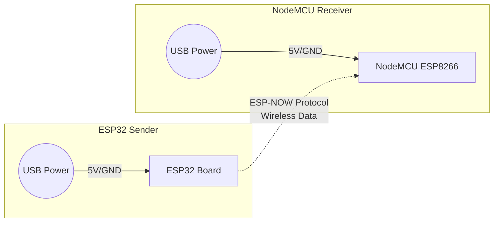

# ESP32 to NodeMCU ESP-NOW Communication

This repository contains the code to transmit data wirelessly from an ESP32 to a NodeMCU (ESP8266) using the ESP-NOW protocol.

## Files
- `esp32_sender/esp32_sender.ino`: The code for the ESP32 that sends the messages.
- `nodemcu_receiver/nodemcu_receiver.ino`: The code for the NodeMCU (ESP8266) that receives the messages.

## Prerequisites
- ESP32 Development Board
- NodeMCU (ESP8266) Development Board
- Arduino IDE with ESP32 and ESP8266 boards installed

## Circuit Diagram

Since ESP-NOW is a wireless communication protocol, there are no data wires connected between the two boards. You only need to power them.

## Configuration
Before uploading the code, ensure you have the correct MAC address of the receiver (NodeMCU). 
Update the `receiverMAC` array in `esp32_sender.ino` with the MAC address of your specific NodeMCU board.

## Usage
1. Open the `.ino` files in the Arduino IDE.
2. Upload `nodemcu_receiver.ino` to your NodeMCU. Open the Serial Monitor (115200 baud) to see it listening.
3. Upload `esp32_sender.ino` to your ESP32. Open the Serial Monitor (115200 baud) to verify it is sending data.
4. You should see the message `HELLO FROM ESP32` appearing on the NodeMCU's Serial Monitor!
